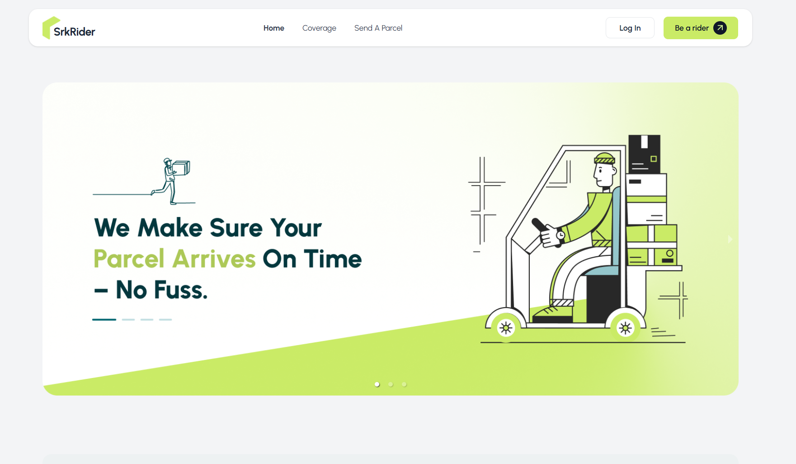
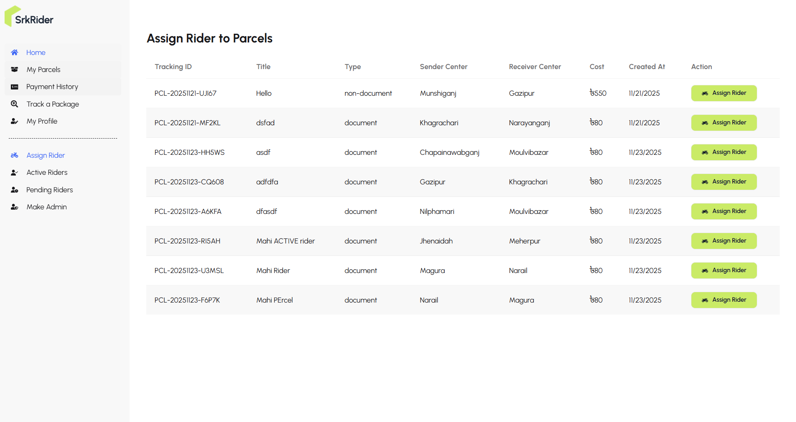

<div align="center">

# ⚡ SrkRider – Smart Parcel Delivery Management System

**A modern parcel-delivery solution designed for customers, delivery riders, and admins.**

_Manage parcel orders, track deliveries live, handle payments, monitor performance, and streamline the entire delivery workflow._


[](https://srk-rider.web.app/)
[](https://react.dev/)
[](https://vitejs.dev/)
[](https://tailwindcss.com/)
[](https://daisyui.com/)
[](https://firebase.google.com/)
[](https://mongodb.com/)
[](https://expressjs.com/)
[](https://tanstack.com/query/latest/)
[](https://vercel.com/)


</div>

---

## 📖 About SkyTower

SrkRider is a complete parcel delivery management system where Users can request parcel delivery from one place to another and also request to become Riders. The platform enables Admins to review parcel requests, approve or reject rider applications, assign parcels, manage active/pending riders, and handle all system operations. Riders can pickup assigned parcels, update delivery statuses, track their earnings, and complete deliveries efficiently — all through a modern, responsive, real-time dashboard experience.

---


## 🖼️ Screenshots

<table>
  <tr>
    <td align="center"><b>Homepage Banner</b></td>
    <td align="center"><b>Dashboard Sample</b></td>
  </tr>
  <tr>
    <td></td>
    <td></td>
  </tr>
</table>

---

## ✨ Key Features

## 🛡️ Role-Based Access Control  
   Separate dashboards for Admin, User, and Rider

---
### 👤 **User Features**

- Request parcel delivery from one location to another 📫  
- Parcel requests are automatically saved and processed in the system 💾  
- Track parcels in real time (Pending → Assigned → Picked → Delivered) 🔄  
- View detailed parcel history and delivery timeline 🔍  
- Make secure online payments using **Stripe** 💳  
- View complete payment history from the dashboard 📜  
- Automated pricing calculation based on weight and delivery region ⚖️  
- Apply to become a Rider directly from the user dashboard 📝  
- Manage personal profile and account settings  


---
### 🏍️ **Rider Features**

- View all assigned deliveries and pickup tasks 📋  
- See **pending** and **completed** deliveries at a glance  
- Update parcel status in real time (Picked → On the Way → Delivered) 🚚  
- Track total earnings and delivery history 💰  
- Manage all delivery tasks from a dedicated rider dashboard  
- Become a rider by applying from the user dashboard 📝  
- Activation handled by Admin through pending/approved rider workflow ✔️✖️  


---

### 👑 **Admin Features**

- Review, approve, or reject **rider applications**  
- View and manage all **parcel requests** across the system 🗃️  
- Assign parcels to Riders quickly and efficiently 🎯  
- Manage the full Rider lifecycle:  
  - **Active Riders**  
  - **Pending Riders**  
  - **Remove Riders**  
- Promote users to Admin using the **Make Admin** feature 🛡️  
- Remove invalid parcel requests or inactive riders 🗑️  
- Monitor system activity with dashboard analytics and parcel statistics 📊  
- Full control over the platform’s workflow, roles, and operations ⚙️  
 

---

### 🔐 Authentication & Security  
- Secure email/password login using **Firebase Authentication** 🔑  
- Firebase ID Tokens used for all protected routes (User, Rider, Admin) 🛡️  
- Automatic login persistence across page reloads ♻️  
- Secure API requests with Axios + Firebase token interceptors 🔐   

---

### 💳 Payment System  
- Users can pay parcel fees online using **Stripe** 💳  
- Instant payment confirmation and status updates ⚡  
- Users can view full payment history in their dashboard 📜  

---

### 🎉 Alerts & Notifications  
- Beautiful success/error alerts using **SweetAlert2 (Swal)** ✨  
- Toast notifications for quick updates using **React Hot Toast** 🔔  
- Used across login, payments, rider activation, parcel status updates, and CRUD operations ✔️  

---

### 🗺️ Tracking & Maps  
- Interactive location mapping using **React Leaflet** 🗺️  
- Riders see exact pickup and delivery locations 📍  
- Users track delivery progress visually in real time 👀  

---

### 🚀 Performance & Modern Tools  
- Lightning-fast development with **Vite** ⚡  
- Real-time background updates using **TanStack React Query** 🔄  
- Fully responsive UI for mobile, tablet, and desktop 📱  
- Tailwind CSS + DaisyUI for a clean, modern look 🎨  
- Animated components using **Lottie** & scroll effects using **AOS** ✨  


## 🌐 Live Demo

**🚀 Try SrkRider:**  
[https://srk-rider.web.app/](https://srk-rider.web.app/)

**🛠️ Server Repository:**  
🔗 https://github.com/shahrukkabir/srk-rider-server

**Admin Credentials:**  
📧 `srkrider@admin.com`  
🔑 `Srkrider.admin`

---

## 🛠️ Tech Stack & Main Packages

- **React** (`^19.1.0`)
- **Vite** (`^6.3.5`)
- **Tailwind CSS** (`^4.1.10`)
- **DaisyUI** (`^5.0.43`)
- **Recharts** (`^3.0.2`)
- **@tanstack/react-query** (`^5.81.2`)
- **Axios** (`^1.10.0`)
- **React Icons** (`^5.5.0`)
- **React Hook Form** (`^7.58.1`)
- **React Hot Toast** (`^2.5.2`)
- **SweetAlert2** (`^11.22.0`)
- **React Leaflet** (`^5.0.0`)
- **Leaflet** (`^1.9.4`)
- **AOS** (`^2.3.4`)
- **Lottie React** (`^2.4.1`)
- **React Fast Marquee** (`^1.6.5`)
- **React Responsive Carousel** (`^3.2.23`)
- **@stripe/react-stripe-js** (`^3.7.0`)
- **@stripe/stripe-js** (`^7.4.0`)
- **Date-fns** (`^4.1.0`)
- **Firebase** (`^11.9.1`)

---

## 📦 Installation

```bash
# Clone the repository
git clone https://github.com/shahrukkabir/srk-rider-client

# Go to the project directory
cd srk-rider-client

# Install dependencies
npm install
```

---

## 🧑‍💻 Development

```bash
# Start the development server
npm run dev
```

The app will be available at [http://localhost:5173](http://localhost:5173) (or as specified by Vite).

---

## 🏗️ Build

```bash
npm run build
```

---

## 🧹 Lint

```bash
npm run lint
```

---

## 👨‍💻 Developer

**[Shahruk Kabir](https://shahrukkabir-me.vercel.app/)**  
[LinkedIn](https://www.linkedin.com/in/shahrukkabir/)

---

## 📄 License

This project is licensed under the MIT License - see the [LICENSE](LICENSE) file for details.